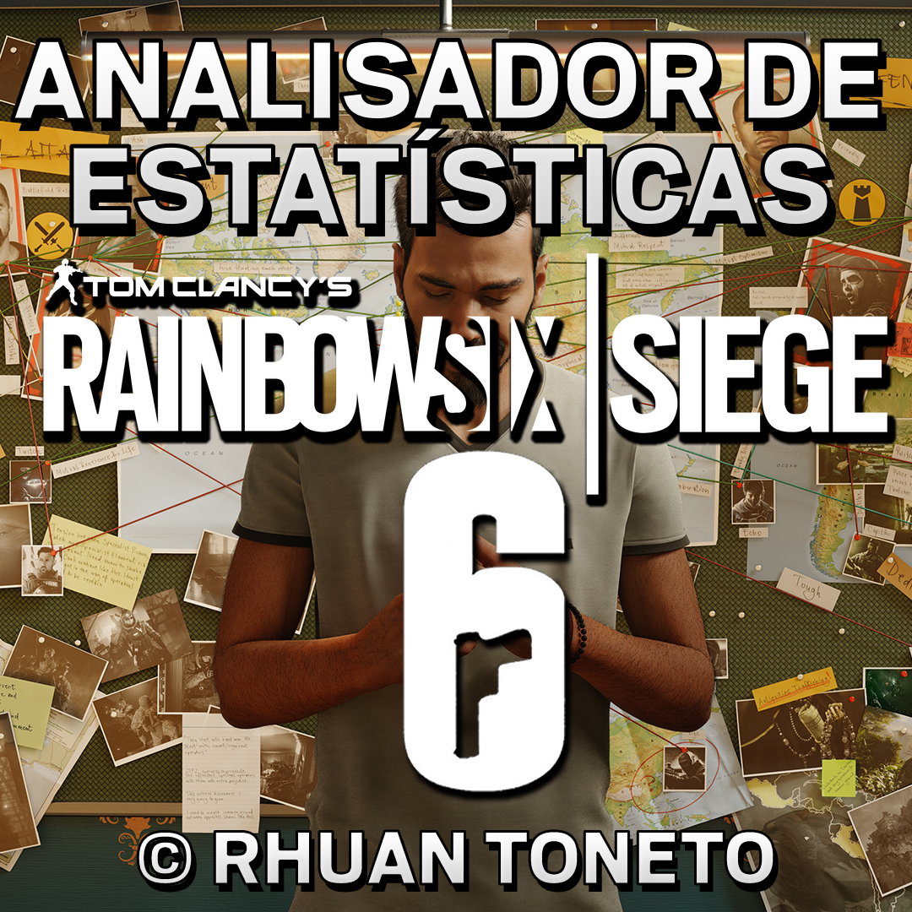
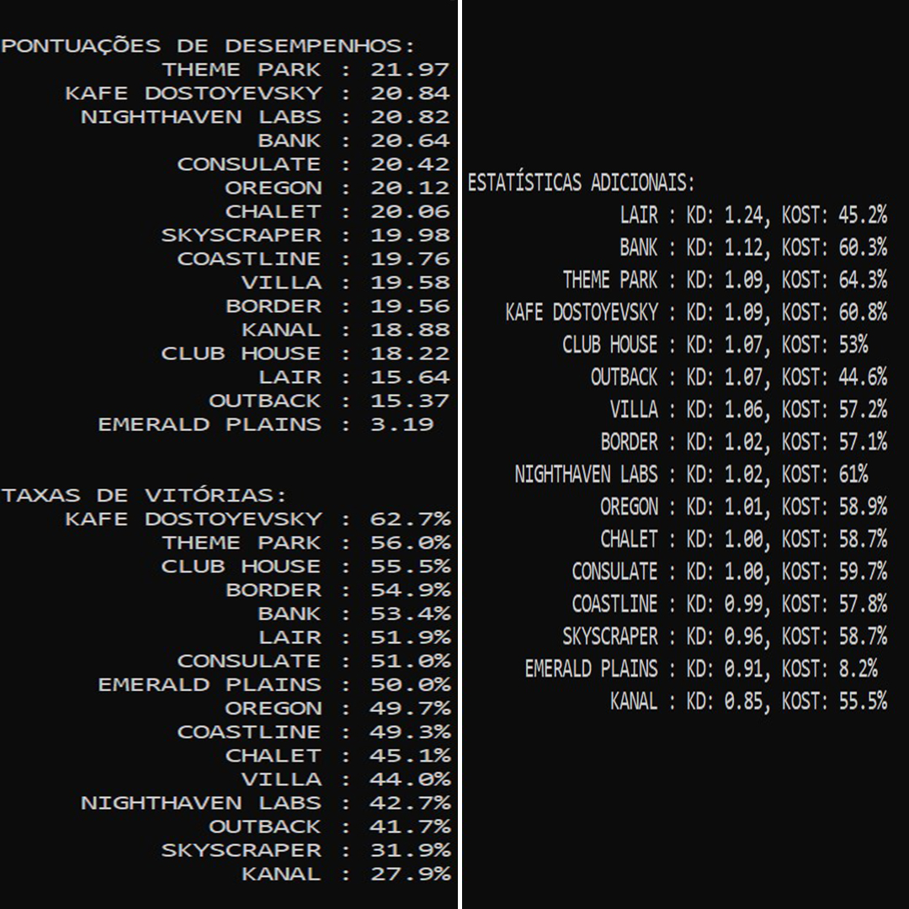

## Analisador de Estatísticas para Rainbow Six Siege

Olá, operadores! 🖱️💻🎮

Já se perguntou como você e/ou sua squad se saem nos diferentes mapas ranqueados do Rainbow Six Siege? Já quis saber em quais mapas é o verdadeiro GOAT, o próximo Nesk, e aqueles onde... se parece mais com um bagre? 😂 

Quer descobrir em quais mapas sua squad parece estar sem sinergia, coordenação, entregando mais que o Sedex 📫 e começar a banir esses mapas? ⛔ Tenho a ferramenta perfeita para você!

|  |  |
|:-------------------------------------:|:-------------------------------------:|

Esta é uma ferramenta em Python que analisa detalhadamente o seu desempenho em cada mapa ranqueado. Utilizando a API siegeapi do CNDRD, ela extrai as estatísticas dos jogadores e calcula taxas de vitória, KD (Kill/Death) e KOST (Kill/Objetive/Survive/Trade), dando a você uma visão de como você e/ou sua squad performam em cada mapa. 

E a melhor parte? Você não precisa ser um expert em Python para usar! O programa pode ser aberto diretamente, sem a necessidade de ter o Python instalado no seu sistema. O executável já inclui todas as dependências e o interpretador necessário. Então, o que está esperando? Vamos aprofundar nessas estatísticas e elevar o seu jogo! 📈

## Como usar? 🤔
1. Baixe clicando aqui [R6MapStats](https://github.com/RhuanToneto/R6MapStats/releases/download/v2.0/R6MapStats.zip).
2. Extraia o conteúdo do arquivo ZIP baixado para a pasta de sua escolha.
3. Navegue até a pasta onde você extraiu os arquivos.
4. Execute o arquivo `R6MapStats.exe` clicando duas vezes nele.
   - Mantenha a pasta do repositório em um local seguro. Recomendo criar um atalho para o executável na área de trabalho para facilitar o acesso. Não copie e nem mova o executável diretamente para a área de trabalho. Lembre-se de que a pasta original é necessária para o 
     armazenamento dos arquivos temporários e não deve ser excluída.
6. O programa solicitará suas credenciais de login da Ubisoft. Quando você já tiver feito login, poderá optar por usar as credenciais salvas futuramente. Suas credenciais serão armazenadas localmente de forma segura.
7. Após fazer login, você verá as seguintes opções:
   - Adicionar jogadores: Insira as UIDs dos jogadores para adicionar à lista de jogadores a serem analisados. Os UIDs dos jogadores também serão salvos localmente para que você não precise inseri-los toda vez que iniciar o programa.
   - É necessário adicionar e selecionar pelo menos um jogador para ser analisado, mas você também pode selecionar um esquadrão de 5 jogadores ou até mais. Quando mais de um jogador é selecionado, o programa calculará médias ponderadas das estatísticas dos jogadores,
     fornecendo insights sobre o desempenho do esquadrão em diferentes mapas.
     Para encontrar o UID de um jogador:
     1. Acesse o [Site da Ubisoft R6 Stats](https://www.ubisoft.com/en-gb/game/rainbow-six/siege/stats/summary).
     2. Faça login com suas credenciais da Ubisoft.
     3. Após o login, o UID do jogador estará no final do link, após `summary/`.
   - Selecionar período de estatísticas: Escolha entre analisar estatísticas dos últimos 1, 2 ou 3 meses. Lembre-se de que a escolha do período de tempo afetará a precisão dos dados. 
     Um período de 3 meses fornece uma visão mais precisa do desempenho do jogador, enquanto períodos mais curtos podem variar mais devido à flutuação no tempo de jogo.

E pronto! ✅

Espero que isso ajude! Boa sorte e bom jogo! GL HF ✌️

"Prepare-se com antecedência e você nunca será pego de surpresa." - Sam "Zero" Fisher

## Exemplo de Uso

```
ESQUADRÃO: JOGADOR 1, JOGADOR 2, JOGADOR 3, JOGADOR 4, JOGADOR 5
INTERVALO DE DADOS: DATA - DATA (Período: X Meses)

TAXAS DE VITÓRIAS:
      EMERALD PLAINS : 66.7%
           COASTLINE : 63.5%
          CLUB HOUSE : 55.9%
    KAFE DOSTOYEVSKY : 55.8%
                LAIR : 54.5%
          THEME PARK : 53.4%
                BANK : 53.4%
              BORDER : 51.0%
           CONSULATE : 48.4%
              CHALET : 46.8%
              OREGON : 46.2%
               VILLA : 44.6%
     NIGHTHAVEN LABS : 41.6%
             OUTBACK : 38.9%
               KANAL : 26.8%
          SKYSCRAPER : 26.4%


ESTATÍSTICAS ATAQUE E DEFESA:
                LAIR : KD: 1.49, KOST: 53.5%
               VILLA : KD: 1.26, KOST: 64.6%
                BANK : KD: 1.20, KOST: 63.9%
           COASTLINE : KD: 1.16, KOST: 65.5%
          CLUB HOUSE : KD: 1.16, KOST: 63.4%
    KAFE DOSTOYEVSKY : KD: 1.13, KOST: 62.8%
          THEME PARK : KD: 1.12, KOST: 67.6%
           CONSULATE : KD: 1.11, KOST: 65.5%
              OREGON : KD: 1.08, KOST: 61.6%
             OUTBACK : KD: 1.08, KOST: 64.7%
              CHALET : KD: 1.05, KOST: 64.7%
     NIGHTHAVEN LABS : KD: 1.05, KOST: 61.9%
              BORDER : KD: 1.04, KOST: 58.1%
               KANAL : KD: 0.94, KOST: 56.4%
          SKYSCRAPER : KD: 0.90, KOST: 56.6%
      EMERALD PLAINS : KD: 0.88, KOST: 15.2%


ESTATÍSTICAS ATAQUE:
                LAIR : KD: 1.43, KOST: 51.1%
                BANK : KD: 1.32, KOST: 65.4%
           COASTLINE : KD: 1.26, KOST: 66.7%
               VILLA : KD: 1.14, KOST: 60.8%
              BORDER : KD: 1.04, KOST: 57.6%
    KAFE DOSTOYEVSKY : KD: 1.04, KOST: 60.2%
             OUTBACK : KD: 1.01, KOST: 60.8%
      EMERALD PLAINS : KD: 1.00, KOST: 14.6%
              CHALET : KD: 0.98, KOST: 63.1%
          THEME PARK : KD: 0.97, KOST: 67.3%
     NIGHTHAVEN LABS : KD: 0.95, KOST: 59.2%
          CLUB HOUSE : KD: 0.91, KOST: 56.8%
              OREGON : KD: 0.88, KOST: 56.5%
           CONSULATE : KD: 0.82, KOST: 61.4%
          SKYSCRAPER : KD: 0.78, KOST: 53.1%
               KANAL : KD: 0.61, KOST: 46.7%


ESTATÍSTICAS DEFESA:
                LAIR : KD: 1.58, KOST: 56.3%
           CONSULATE : KD: 1.50, KOST: 69.9%
          CLUB HOUSE : KD: 1.46, KOST: 70%
               VILLA : KD: 1.41, KOST: 68.8%
              OREGON : KD: 1.34, KOST: 67.1%
               KANAL : KD: 1.31, KOST: 65.3%
          THEME PARK : KD: 1.29, KOST: 67.9%
    KAFE DOSTOYEVSKY : KD: 1.25, KOST: 65.8%
     NIGHTHAVEN LABS : KD: 1.17, KOST: 64.8%
             OUTBACK : KD: 1.16, KOST: 68.5%
              CHALET : KD: 1.12, KOST: 66.6%
                BANK : KD: 1.09, KOST: 62.4%
           COASTLINE : KD: 1.06, KOST: 64.7%
              BORDER : KD: 1.03, KOST: 58.4%
          SKYSCRAPER : KD: 1.02, KOST: 59.5%
      EMERALD PLAINS : KD: 0.71, KOST: 15.9%


DESEMPENHO GERAL:
                LAIR : 100.0
               VILLA : 92.0
           CONSULATE : 82.3
     NIGHTHAVEN LABS : 79.0
           COASTLINE : 77.8
              OREGON : 77.2
          CLUB HOUSE : 76.1
          THEME PARK : 75.1
              CHALET : 74.1
                BANK : 73.5
    KAFE DOSTOYEVSKY : 72.2
             OUTBACK : 71.5
              BORDER : 70.4
               KANAL : 61.5
          SKYSCRAPER : 59.4
      EMERALD PLAINS : 0.0
```

## Direitos Autorais (c) 2021-2024 CNDRD
[Repositório da API](https://github.com/CNDRD/siegeapi)
[Documentação da API](https://cndrd.github.io/siegeapi)

## Aviso Importante
Esta ferramenta não é afiliada ou endossada pela Ubisoft ou pela equipe de desenvolvimento do Tom Clancy's Rainbow Six Siege. É um projeto independente criado para fins educacionais e analíticos.

## Contribuindo
Se você encontrar bugs ou tiver sugestões de melhorias, sinta-se à vontade para compartilhar. Este projeto é um trabalho em andamento e estou aberto a sugestões e correções para melhorá-lo.
